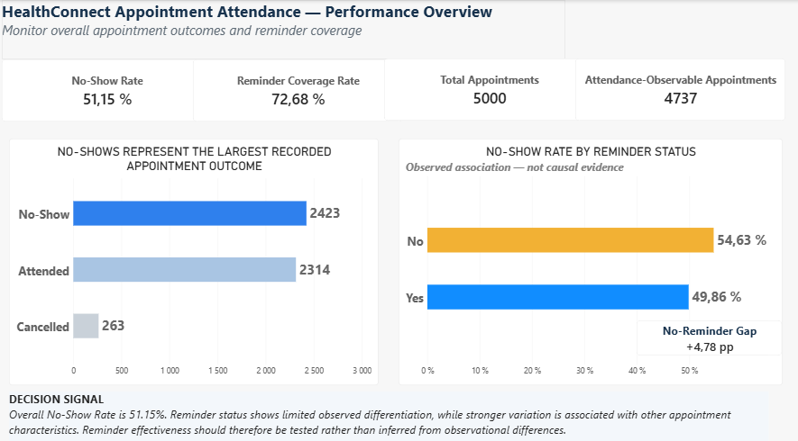
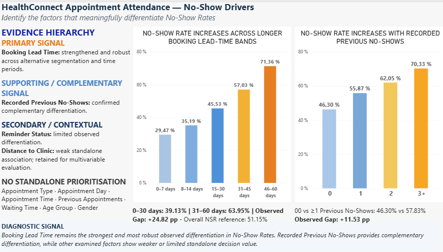
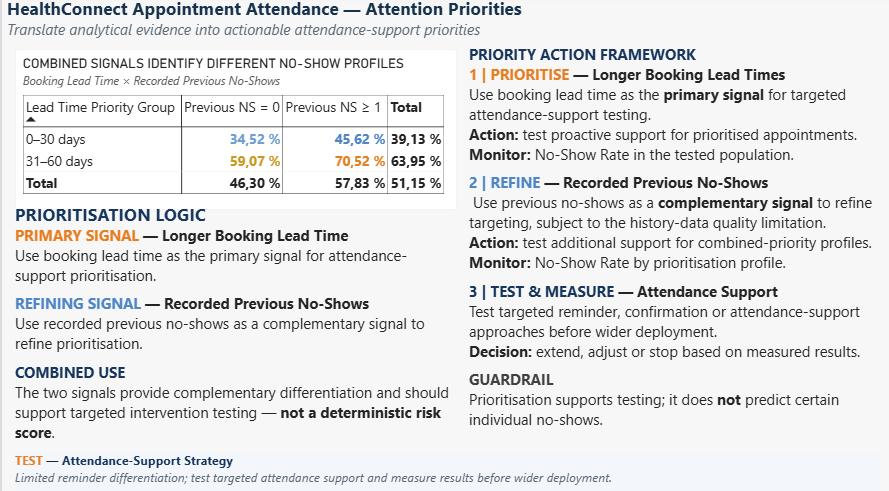

# HealthConnect Experience Lab

## Improving Patient Appointment Attendance and Healthcare Support Using Data and AI

**Track:** Data Analytics  
**Analyst:** Nancy Lee YIMBERE ALAPINI  
**Professional Focus:** Performance & Decision Intelligence  
**Programme:** AnalystLab Africa Internship Programme  
**Project Status:** **Week 6 — Advanced Analytics, Cross-Track Integration & Validation Completed**

> **Current analytical focus:** advancing appointment-attendance analysis from validated findings to integrated, testable decision support.

---

## Project Overview

HealthConnect Experience Lab is a multi-week analytics project focused on understanding appointment attendance patterns and supporting better operational decision-making around patient attendance.

The project progressively moves from business understanding and data-quality assessment to exploratory analysis, KPI development, advanced validation, cross-track integration, decision support and testing.

The central business question is:

> **How can HealthConnect use appointment data to better understand attendance patterns, identify meaningful no-show signals, prioritise attendance-support actions, and improve decision-making without overstating what the available data can prove?**

The analytical unit is the **appointment record**.

The project does not treat repeated `patient_id` values as fully reliable longitudinal patient histories because patient-level consistency checks identified limitations in recorded demographic and historical variables.

---

# Quick Navigation — Week 6 Deliverables

### Advanced Analytics & Decision Support Notebook

[View Week 6 Advanced Analytics & Decision Support Notebook](notebooks/WK6_HealthConnect_Advanced_Analytics_Decision_Support_Notebook_Nancy_Lee_YIMBERE_ALAPINI.pdf)

### Power BI Dashboard

[Download Week 6 Power BI Dashboard](dashboards/WK6_HealthConnect_Analytics_Dashboard_Nancy_Lee_YIMBERE_ALAPINI.pbix)

### Week 6 Project Summary

[View Week 6 Project Summary](reports/WK6_HealthConnect_Project_Summary_Nancy_Lee_YIMBERE_ALAPINI.pdf)

### Cross-Track Integration Evidence

[View Data Analytics × Data Science Cross-Track Integration Evidence](reports/WK6_HealthConnect_Cross_Track_Integration_Evidence_Nancy_Lee_YIMBERE_ALAPINI.pdf)

---

# Project Continuity

The HealthConnect project is developed as a progressive analytical workflow.

### Week 4 — Analytical Foundation

**UNDERSTAND → REVIEW → DEFINE → PLAN**

Business understanding, dataset review, data-quality assessment, analytical questions, hypotheses and initial KPI framework.

### Week 5 — Analysis & Initial Implementation

**PREPARE → ANALYSE → VALIDATE → MONITOR → DIAGNOSE → PRIORITIZE**

Data preparation, exploratory analysis, KPI development, statistical validation, Power BI dashboard development and initial decision-support recommendations.

### Week 6 — Advanced Analytics, Integration & Validation

**SELECT → DEEPEN → VALIDATE → INTEGRATE → DECIDE → PREPARE TO TEST**

Priority findings were subjected to robustness analysis, combined-signal analysis, KPI revalidation and cross-track review with Data Science before being translated into refined decision support.

### Week 7 — Testing & Refinement

**TEST → REFINE → VALIDATE**

The next stage will focus on testing the operational usefulness of the prioritisation framework and evaluating attendance-support interventions before wider deployment.

---

# WEEK 4 — ANALYTICAL FOUNDATION

## Week 4 Objective

Week 4 established the analytical foundation of the HealthConnect project.

The work focused on:

- understanding the business problem;
- reviewing the appointment dataset and data dictionary;
- assessing data quality;
- identifying analytical limitations;
- defining relevant business questions;
- formulating analytical hypotheses;
- identifying potential KPIs;
- defining an initial analysis approach.

---

## Dataset Overview

The HealthConnect appointment dataset contains:

- **5,000 appointment records**
- **18 variables**
- **5,000 unique appointment IDs**
- **1,696 distinct patient IDs**

The appointment period runs from:

**1 January 2025 → 30 June 2026**

The dataset contains information related to:

- appointment outcomes;
- appointment type;
- booking and appointment dates;
- booking lead time;
- appointment day and time;
- reminder status and channel;
- recorded previous appointments;
- recorded previous no-shows;
- distance to clinic;
- estimated waiting time;
- age, age group and gender.

---

## Initial Data-Quality Findings

Key validation results included:

| Data-Quality Check | Result |
|---|---:|
| Appointment records | 5,000 |
| Unique `appointment_id` | 5,000 |
| Exact duplicate rows | 0 |
| Missing `distance_to_clinic_km` | 90 |
| Missing `waiting_time_minutes` | 60 |
| Booking date after appointment date | 0 |
| `booking_lead_days` inconsistencies | 0 |
| `appointment_day` inconsistencies | 0 |
| `previous_no_shows > previous_appointments` | 0 |
| `age_group` inconsistent with recorded age | 0 |

The literal value `None` in `reminder_channel` corresponds structurally to appointments where `reminder_sent = No`; it is therefore treated as **not applicable**, not as an unexplained technical null.

### Patient-Level Limitation

Repeated `patient_id` values showed inconsistencies across some demographic and historical fields.

Therefore:

> **The appointment record remains the analytical unit, and reliable longitudinal patient histories are not reconstructed from the dataset.**

---

# WEEK 5 — ANALYSIS & INITIAL IMPLEMENTATION

## Week 5 Objective

Week 5 transformed the analytical foundation into an initial decision-support system through:

- data preparation;
- exploratory data analysis;
- KPI development;
- statistical validation;
- Power BI dashboard development;
- evidence-based findings;
- initial recommendations.

---

## Week 5 Outcome Baseline

Recorded appointment outcomes:

| Appointment Outcome | Count | Share of All Appointments |
|---|---:|---:|
| No-Show | 2,423 | 48.46% |
| Attended | 2,314 | 46.28% |
| Cancelled | 263 | 5.26% |
| **Total** | **5,000** | **100%** |

For attendance analysis, cancelled appointments are excluded from the No-Show Rate denominator because they do not reach the point at which attendance versus no-show is observable.

### Attendance-Observable Population

**Attended + No-Show = 4,737 appointments**

---

## KPI Framework

### 1. No-Show Rate — Primary Outcome KPI

**Formula**

`No-Shows / (No-Shows + Attended)`

**Value: 51.15%**

This is a descriptive performance reference, **not an external benchmark or target**.

### 2. Reminder Coverage Rate — Secondary Process KPI

**Formula**

`Appointments with Reminder Sent / Total Appointments`

**Value: 72.68%**

This measures reminder-process execution, not reminder effectiveness.

### Diagnostic Comparative Metric

**No-Show Rate by Reminder Status**

- No Reminder: **54.63%**
- Reminder Sent: **49.86%**
- Observed Gap: **+4.78 percentage points**

This is retained as a **diagnostic metric**, not as a standalone outcome KPI.

> **A measure becomes a management KPI when it is connected to a decision, action or process that needs to be monitored.**

---

## Week 5 Analytical Evidence Base

Week 5 identified two particularly relevant analytical signals:

### Booking Lead Time

No-Show Rates increased across longer booking lead-time bands.

### Recorded Previous No-Shows

Appointments with higher recorded previous no-show counts showed higher observed No-Show Rates.

These findings became the evidence base for deeper Week 6 robustness testing.

---

# WEEK 6 — ADVANCED ANALYTICS & DECISION SUPPORT

## Week 6 Objective

Week 6 moved beyond initial exploratory findings.

The objective was to determine whether the most important Week 5 findings remained meaningful after deeper analytical validation and whether they could support defensible operational decisions.

The Week 6 workflow was:

> **WEEK 5 EVIDENCE → SELECT → DEEPEN → VALIDATE → PRIORITIZE → HANDOFF → INTEGRATE → DECIDE → ACT → MONITOR → PREPARE TO TEST**

The work included:

- revalidation of the analytical Single Source of Truth;
- KPI revalidation and refinement;
- robustness analysis;
- alternative segmentation;
- temporal stability analysis;
- combined-signal analysis;
- multivariable descriptive modelling;
- evidence-strength assessment;
- Data Analytics × Data Science integration;
- decision translation;
- measurable recommendation design;
- dashboard refinement;
- Week 7 testing preparation.

---

# Week 6 KPI Revalidation

| Measure | Week 6 Classification | Value |
|---|---|---:|
| No-Show Rate | **Primary Outcome KPI** | **51.15%** |
| Reminder Coverage Rate | **Secondary Process KPI** | **72.68%** |
| No-Show Rate by Reminder Status | Diagnostic Comparative Metric | 54.63% vs 49.86% |
| No-Reminder Gap | Supporting Diagnostic Metric | +4.78 pp |

No additional KPI was introduced simply because a variable showed statistical differentiation.

The Week 6 principle remains:

> **No KPI without a decision, action or management process to monitor.**

---

# Advanced Analytical Findings

## 1. Booking Lead Time — Strengthened Primary Signal

Booking Lead Time remained the **strongest and most robust observed differentiation** in No-Show Rates.

### Week 6 Simplified Comparison

| Booking Lead Time | No-Show Rate |
|---|---:|
| 0–30 days | **39.13%** |
| 31–60 days | **63.95%** |
| **Observed Gap** | **+24.82 pp** |

The relative risk for the longer lead-time group was approximately:

**RR = 1.63**

The pattern remained directionally stable across:

- alternative booking-lead segmentation;
- statistical robustness checks;
- different time periods.

### Detailed Lead-Time Bands

| Booking Lead Time | No-Show Rate |
|---|---:|
| 0–7 days | 29.47% |
| 8–14 days | 35.19% |
| 15–30 days | 45.53% |
| 31–45 days | 57.03% |
| 46–60 days | 71.36% |

### Week 6 Interpretation

> **Booking Lead Time remains the strongest and most robust observed differentiation in No-Show Rates and is retained as the primary signal for attendance-support prioritisation and testing.**

This is an observed analytical relationship and does **not** establish that longer booking lead time causes no-shows.

---

## 2. Recorded Previous No-Shows — Confirmed Complementary Signal

Recorded Previous No-Shows remained a meaningful supporting signal.

| Recorded Previous No-Shows | No-Show Rate |
|---|---:|
| 0 | 46.30% |
| 1 | 55.87% |
| 2 | 62.05% |
| 3+ | 70.33% |

### Robust Comparison

| Recorded History | No-Show Rate |
|---|---:|
| Previous NS = 0 | **46.30%** |
| Previous NS ≥ 1 | **57.83%** |
| **Observed Gap** | **+11.53 pp** |

### Week 6 Interpretation

> **Recorded Previous No-Shows provides complementary differentiation and can refine prioritisation based on Booking Lead Time.**

However, this variable remains subject to the known patient-history consistency limitation.

It is therefore used as a **supporting signal**, not as a verified longitudinal behavioural history.

---

# Combined-Signal Analysis

Week 6 tested whether Booking Lead Time and Recorded Previous No-Shows provide useful information when considered jointly.

| Booking Lead Time | Previous NS = 0 | Previous NS ≥ 1 | Total |
|---|---:|---:|---:|
| 0–30 days | **34.52%** | **45.62%** | **39.13%** |
| 31–60 days | **59.07%** | **70.52%** | **63.95%** |
| **Total** | **46.30%** | **57.83%** | **51.15%** |

The two signals provide **complementary differentiation**.

However, the statistical interaction between Booking Lead Time and Recorded Previous No-Shows was **not supported**.

### Decision Implication

The evidence supports using both variables to refine attendance-support prioritisation.

It does **not** justify building an unnecessarily complex deterministic risk score.

> **Combined analytical signals support prioritisation for testing — not certainty about an individual patient's future attendance.**

---

# Week 6 Evidence Hierarchy

## PRIMARY SIGNAL

### Booking Lead Time

**Evidence strength:** High  
**Decision relevance:** High

Strengthened through robustness analysis, alternative segmentation, temporal validation and cross-track modelling evidence.

---

## SUPPORTING / COMPLEMENTARY SIGNAL

### Recorded Previous No-Shows

**Evidence strength:** Moderate-to-Strong  
**Decision relevance:** Moderate-to-High

Provides additional differentiation beyond Booking Lead Time, while remaining subject to the patient-history data-quality limitation.

---

## SECONDARY / CONTEXTUAL SIGNALS

### Reminder Status

Limited observed differentiation.

Operationally relevant, but current observational evidence does not establish reminder effectiveness.

### Distance to Clinic

Weak standalone analytical association.

Retained for multivariable evaluation following Data Science review.

---

## NO STANDALONE PRIORITISATION

The following variables did not demonstrate sufficient standalone decision value in the current Data Analytics evidence:

- Appointment Type
- Appointment Day
- Appointment Time
- Previous Appointments
- Waiting Time
- Age Group
- Gender

These variables may still provide contextual or multivariable information, but the current evidence does not justify using them independently for operational prioritisation.

---

# Data Analytics × Data Science Cross-Track Integration

Week 6 included a structured cross-track collaboration between:

**Nancy Lee YIMBERE ALAPINI**  
*Data Analytics — Performance & Decision Intelligence*

and

**AYDEN NGNINTEDEM DEMANOU**  
*Data Science Intern — HealthConnect Pod 01*

The objective was not simply to confirm the Data Analytics findings.

The integration was designed to:

- challenge the Analytics evidence using modelling results;
- assess whether the priority signals remained useful in a broader feature space;
- identify additional predictive information;
- identify divergences between univariate Analytics and multivariable Data Science;
- refine the final decision-support interpretation.

---

## Cross-Track Evidence Flow

> **Validated Analytics Evidence → Data Science Challenge → Predictive Evidence → Integration Back → Refined Decision Support**

Data Analytics provided:

- validated Week 6 findings;
- analytical population definition;
- KPI definitions;
- Booking Lead Time evidence;
- Recorded Previous No-Shows evidence;
- Reminder Status evidence;
- combined-signal analysis;
- methodological guardrails;
- specific modelling questions.

Data Science provided:

- Random Forest feature-relevance evidence;
- feature hierarchy;
- raw and engineered predictive features;
- additional modelling perspective on Distance, Age and recorded history.

---

## Integration Back — What Changed?

| Analytics Evidence | Data Science Input | Final Integration Decision |
|---|---|---|
| Booking Lead Time = primary signal | Multiple lead-time representations retained in the predictive feature hierarchy | **STRENGTHENED** |
| Recorded Previous No-Shows = complementary signal | Raw and derived recorded-history features retained | **CONFIRMED / NUANCED** |
| Distance = weak standalone Analytics association | Greater multivariable predictive relevance | **NUANCED** |
| Age Group = weak standalone Analytics differentiation | Continuous Age appears in predictive modelling | **NUANCED** |
| Reminder = secondary/contextual | Reminder-related feature remains secondary in modelling | **CONSISTENT / TESTABLE** |

### Important Interpretation

Multiple Data Science representations of Booking Lead Time — including engineered features — reinforce the predictive relevance of the **underlying Lead Time dimension**.

Their feature importances are **not summed**, because the features overlap conceptually.

Similarly, predictive feature importance is not interpreted as causal importance.

---

## Cross-Track Evidence

The complete collaboration evidence is documented here:

[View Week 6 Cross-Track Integration Evidence](reports/WK6_HealthConnect_Cross_Track_Integration_Evidence_Nancy_Lee_YIMBERE_ALAPINI.pdf)

---

# Week 6 Power BI Decision-Support Dashboard

The Week 6 Power BI dashboard follows the decision-support sequence:

> **MONITOR → DIAGNOSE → PRIORITIZE**

---

## 01 | MONITOR — Performance Overview



### Purpose

Monitor the overall appointment-attendance situation and reminder-process coverage.

### Core Metrics

- **No-Show Rate:** 51.15%
- **Reminder Coverage Rate:** 72.68%
- **Total Appointments:** 5,000
- **Attendance-Observable Appointments:** 4,737

### Decision Signal

Overall No-Show Rate is **51.15%**.

Reminder status shows limited observed differentiation, while stronger variation is associated with other appointment characteristics.

Reminder effectiveness should therefore be **tested rather than inferred from observational differences**.

---

## 02 | DIAGNOSE — No-Show Drivers



### Purpose

Identify which factors meaningfully differentiate observed No-Show Rates.

### Diagnostic Conclusion

Booking Lead Time remains the strongest and most robust observed differentiation in No-Show Rates.

Recorded Previous No-Shows provides complementary differentiation, while other examined factors show weaker or limited standalone decision value.

### Key Diagnostic References

**Booking Lead Time**

- 0–30 days: **39.13%**
- 31–60 days: **63.95%**
- Observed Gap: **+24.82 pp**

**Recorded Previous No-Shows**

- Previous NS = 0: **46.30%**
- Previous NS ≥ 1: **57.83%**
- Observed Gap: **+11.53 pp**

---

## 03 | PRIORITIZE — Attention Priorities



### Purpose

Translate analytical evidence into actionable attendance-support priorities.

### Prioritisation Logic

#### 1 | PRIORITISE — Longer Booking Lead Times

Use Booking Lead Time as the **primary signal** for targeted attendance-support testing.

**Action:** test proactive support for prioritised appointments.  
**Monitor:** No-Show Rate in the tested population.

#### 2 | REFINE — Recorded Previous No-Shows

Use Recorded Previous No-Shows as a **complementary signal** to refine targeting, subject to the history-data quality limitation.

**Action:** test additional support for combined-priority profiles.  
**Monitor:** No-Show Rate by prioritisation profile.

#### 3 | TEST & MEASURE — Attendance Support

Test targeted reminder, confirmation or attendance-support approaches before wider deployment.

**Decision:** extend, adjust or stop based on measured results.

### Guardrail

> **Prioritisation supports testing; it does not predict certain individual no-shows.**

---

# Week 6 Decision-Support Framework

The Week 6 analytical evidence supports three levels of action.

## PRIORITISE

Use **Booking Lead Time** as the primary signal for identifying appointments where additional attendance-support testing may be most relevant.

## REFINE

Use **Recorded Previous No-Shows** as a complementary signal to refine the prioritisation population.

## TEST & MEASURE

Evaluate targeted attendance-support approaches before wider implementation.

Potential approaches may include:

- targeted reminders;
- appointment confirmation;
- proactive attendance support;
- follow-up for prioritised appointments.

The dataset does not establish that any of these interventions will cause lower no-show rates.

Their effectiveness must therefore be **measured through testing**.

---

# Evidence → Decision Framework

The project uses the following decision-intelligence sequence:

> **Finding → Evidence Strength → Interpretation → Business Implication → Decision → Action → Monitoring KPI → Expected Result → Validation / Test**

This prevents analytical findings from being converted directly into recommendations without considering:

- robustness;
- practical relevance;
- limitations;
- implementation;
- monitoring;
- validation.

---

# Interpretation & Decision Guardrails

## Association ≠ Causality

Observed differences and statistical associations do not demonstrate causal effects.

## Predictive Relevance ≠ Causal Importance

A variable that is useful in a predictive model is not automatically a causal mechanism or an operational intervention target.

## Statistical Significance ≠ Business Significance

P-values are interpreted alongside:

- effect size;
- robustness;
- sample size;
- operational relevance;
- decision usefulness.

## Benchmark ≠ Target

The overall No-Show Rate of **51.15%** is an internal descriptive reference.

It is not an external benchmark or performance target.

## Reminder Exposure ≠ Reminder Effectiveness

`reminder_sent = Yes` indicates recorded reminder exposure.

It does not prove that the reminder was:

- received;
- read;
- understood;
- acted upon;
- responsible for the appointment outcome.

## Recorded Patient History ≠ Verified Longitudinal History

Recorded Previous No-Shows is analytically useful but remains subject to patient-level consistency limitations.

## Feature Importance ≠ Decision Rule

Random Forest feature importance is model-dependent.

It does not automatically justify an operational targeting rule.

## Derived Feature Importances Must Not Be Summed

Engineered features such as multiple representations of Booking Lead Time may reflect the same underlying information.

Their feature importances should not be added together to create an artificial importance score.

## Prioritisation ≠ Deterministic Prediction

The framework identifies populations for **support and testing**.

It does not classify individual patients as certain future no-shows.

---

# Week 7 — Testing & Refinement Focus

Week 7 should move from analytical prioritisation toward controlled operational validation.

Priority testing requirements include:

### 1. Test Attendance-Support Strategies

Evaluate whether targeted reminder, confirmation or attendance-support approaches improve attendance outcomes.

### 2. Compare Prioritisation Profiles

Measure outcomes across:

- shorter vs longer Booking Lead Time;
- Previous NS = 0 vs Previous NS ≥ 1;
- combined priority profiles.

### 3. Validate Operational Usefulness

Determine whether the proposed prioritisation framework is practical for HealthConnect operations.

### 4. Evaluate Data Science Contribution

Assess whether multivariable predictive features materially improve decision support beyond the simpler Analytics prioritisation framework.

### 5. Preserve Methodological Distinctions

Week 7 should continue distinguishing:

> **Association → Prediction → Intervention → Causal Evidence**

### 6. Define Extension / Adjustment / Stop Criteria

Attendance-support approaches should only be extended after measured evidence demonstrates sufficient operational value.

---

# Analytical Method

The broader project methodology follows:

> **Business Problem → Business Questions → Hypotheses → Data → Analysis → Findings → Insights → Business Implications → Recommendations → Decision Support**

Week 6 adds an explicit validation and integration layer:

> **Evidence → Validation → Integration → Decision → Action → Monitoring → Test**

The objective is not simply to produce analytical results.

The objective is to reduce decision uncertainty while preserving analytical integrity.

---

# Repository Structure

```text
healthconnect-experience-lab/
│
├── assets/
│   ├── week5/
│   └── week6/
│       ├── 01_monitor.png
│       ├── 02_diagnose.png
│       └── 03_prioritize.png
│
├── dashboards/
│   ├── [Week 5 dashboard]
│   └── WK6_HealthConnect_Analytics_Dashboard_Nancy_Lee_YIMBERE_ALAPINI.pbix
│
├── notebooks/
│   ├── [Week 4 notebook]
│   ├── [Week 5 notebook]
│   └── WK6_HealthConnect_Advanced_Analytics_Decision_Support_Notebook_Nancy_Lee_YIMBERE_ALAPINI.pdf
│
├── reports/
│   ├── [Week 4 reports]
│   ├── [Week 5 reports]
│   ├── WK6_HealthConnect_Project_Summary_Nancy_Lee_YIMBERE_ALAPINI.pdf
│   └── WK6_HealthConnect_Cross_Track_Integration_Evidence_Nancy_Lee_YIMBERE_ALAPINI.pdf
│
└── README.md
