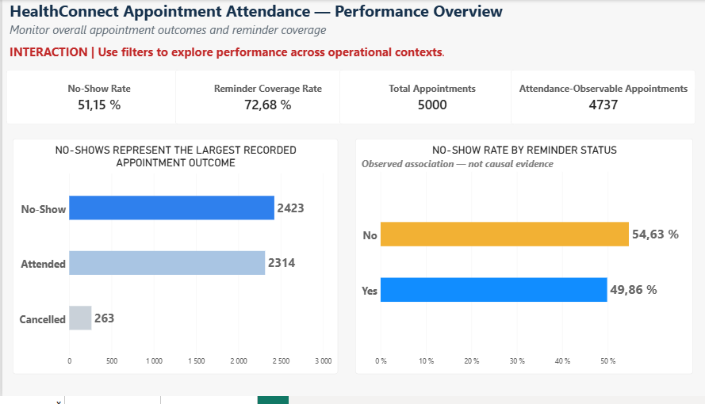
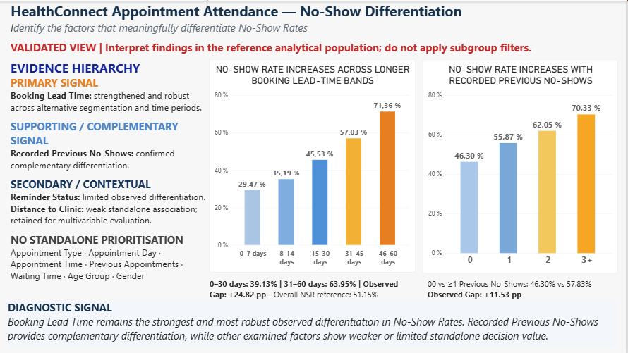
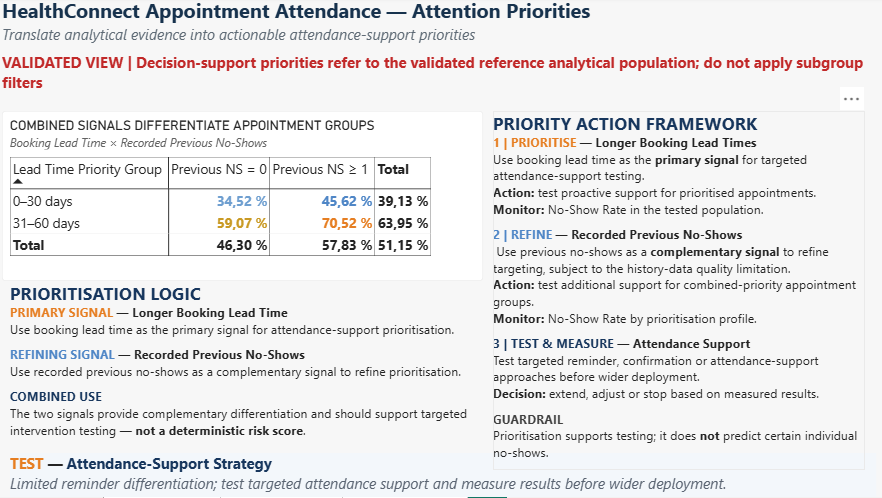
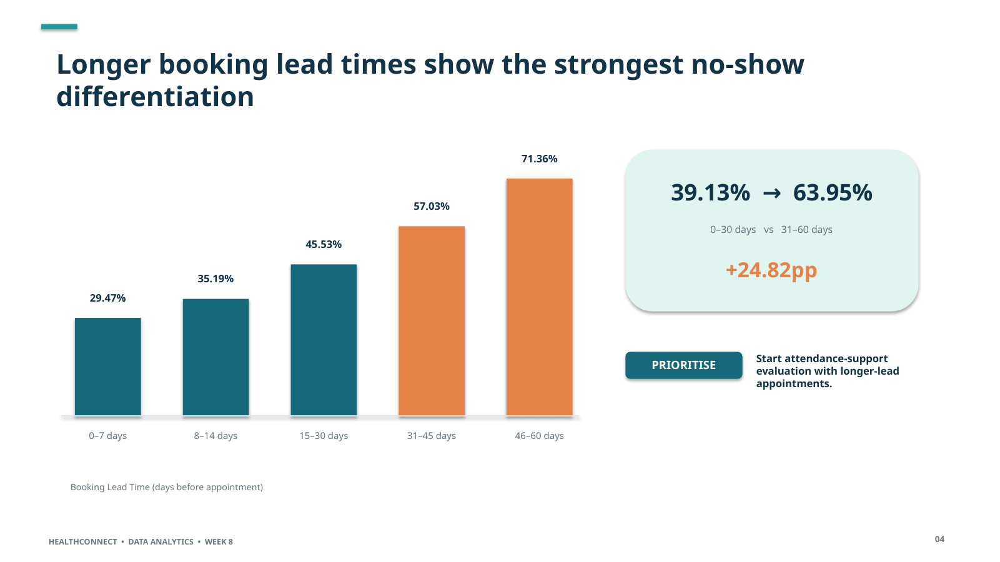
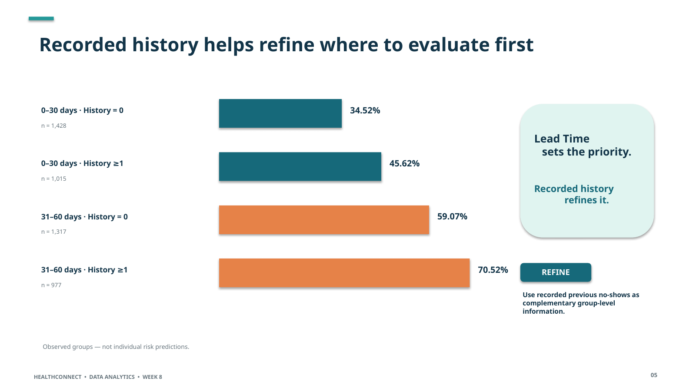
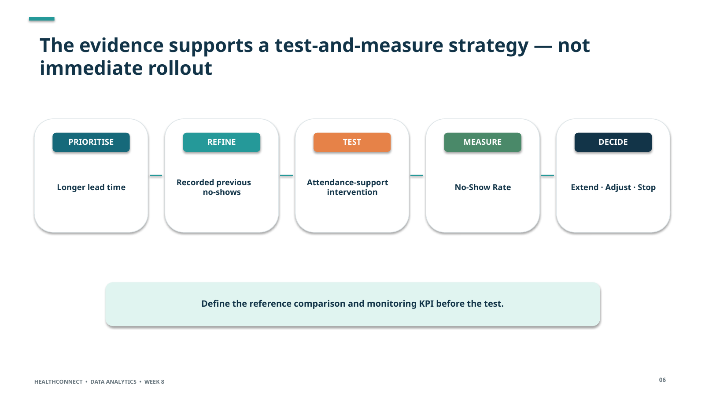

<p align="center">
  
</p>

# HealthConnect Experience Lab

## Improving Patient Appointment Attendance and Healthcare Support Using Data and AI

**Track:** Data Analytics  
**Analyst:** Nancy Lee YIMBERE ALAPINI  
**Professional Focus:** Performance & Decision Intelligence  
**Programme:** AnalystLab Africa Internship Programme  
**Project Coverage:** Weeks 4–8  
**Final Status:** Week 8 — Final Analytics & Decision Support Package Completed

> **Final analytical focus:** transform validated appointment-attendance evidence into a defensible decision-support framework that tells HealthConnect where to evaluate attendance support first, how to refine that evaluation population, and how to measure whether an action works.

---

# Project Overview

HealthConnect Experience Lab is a multi-week analytics project focused on understanding patient appointment attendance patterns and supporting better operational decision-making around patient attendance.

Across Weeks 4–8, the Data Analytics workstream progressively moved through:

**Business Understanding → Data Quality → Analysis → KPI Design → Validation → Dashboard Development → Advanced Testing → Cross-Track Collaboration → Refinement → Decision Support → Final Integration**

The central business question is:

> **How can HealthConnect use appointment data to better understand attendance patterns, identify meaningful no-show signals, prioritise attendance-support actions, and improve decision-making without overstating what the available data can prove?**

By Week 8, this was translated into a more operational decision question:

> **Where should HealthConnect start if it wants to test attendance support — and how should success be measured?**

The analytical unit remains the **appointment record**.

The project does not reconstruct reliable longitudinal patient histories because patient-level consistency checks identified limitations in recorded demographic and historical variables.

The final solution therefore supports **group-level prioritisation and controlled evaluation**, not deterministic individual patient prediction.

---

# Quick Navigation — Final Project

### Week 8 Final Analytics & Decision Support Report

[View Week 8 Final Analytics & Decision Support Report](reports/WK8_HealthConnect_Final_Analytics_Decision_Support_Report_Nancy_Lee_YIMBERE_ALAPINI.pdf)

### Week 8 Executive Summary

[View Week 8 Executive Summary](reports/WK8_HealthConnect_Executive_Summary_Nancy_Lee_YIMBERE_ALAPINI.pdf)

### Week 8 Integration Readiness Evidence

[View Week 8 Integration Readiness Evidence](reports/WK8_HealthConnect_Integration_Readiness_Evidence_Nancy_Lee_YIMBERE_ALAPINI.pdf)

### Final Power BI Dashboard

[Download Week 8 Power BI Dashboard](dashboards/WK8_HealthConnect_Analytics_Dashboard_Nancy_Lee_YIMBERE_ALAPINI.pbix)

### Stakeholder Presentation — PDF

[View Week 8 Stakeholder Presentation](reports/WK8_HealthConnect_Stakeholder_Presentation_Nancy_Lee_YIMBERE_ALAPINI.pdf)

### Stakeholder Presentation — PowerPoint

[Download Week 8 Stakeholder Presentation](reports/WK8_HealthConnect_Stakeholder_Presentation_Nancy_Lee_YIMBERE_ALAPINI.pptx)

### Week 7 Testing & Validation Evidence Pack

[Download Week 7 Testing & Validation Evidence Pack](analysis/WK7_HealthConnect_Testing_Validation_Evidence_Pack_Nancy_Lee_YIMBERE_ALAPINI.xlsx)

### Data Analytics × Data Science Collaborative Evidence

[View DA × DS Cross-Track Testing & Validation Evidence](notebooks/WK7_HealthConnect_DA_DS_Cross-Track_Testing_Validation_Evidence.pdf)

---

# Project Continuity

The HealthConnect project follows a progressive analytical and decision-support workflow.

## Week 4 — Analytical Foundation

**UNDERSTAND → REVIEW → DEFINE → PLAN**

Business understanding, dataset review, data-quality assessment, analytical questions, hypotheses and initial KPI framework.

## Week 5 — Analysis & Initial Implementation

**PREPARE → ANALYSE → VALIDATE → MONITOR → DIAGNOSE → PRIORITIZE**

Data preparation, exploratory data analysis, KPI development, statistical validation, Power BI dashboard development and initial decision-support recommendations.

## Week 6 — Advanced Analytics & Decision Support

**SELECT → DEEPEN → VALIDATE → INTEGRATE → DECIDE → PREPARE TO TEST**

Week 6 strengthened the analytical evidence hierarchy through robustness analysis, combined-signal analysis, multivariable modelling, Data Analytics × Data Science integration, measurable recommendation design and decision-support refinement.

## Week 7 — Testing, Refinement & End-to-End Validation

**REVIEW → TEST → COMPARE → VALIDATE → REFINE → RE-TEST → DOCUMENT**

Week 7 challenged the existing solution rather than introducing a new analysis.

The focus was to determine whether the Week 6 outputs were:

- correctly calculated;
- analytically robust;
- consistently represented in Power BI;
- safe to interpret under dashboard interactions;
- aligned with evidence strength;
- useful for operational decision support;
- consistent with Data Science findings;
- ready for final integration.

## Week 8 — Final Integration & Decision Support

**CONSOLIDATE → INTEGRATE → COMMUNICATE → RECOMMEND → MEASURE → DECIDE**

Week 8 did not reopen validated Week 7 findings without new evidence.

It consolidated the validated analytical solution into a final stakeholder-oriented package by:

- preserving validated KPI definitions;
- preserving the final analytical evidence hierarchy;
- integrating validated Data Analytics × Data Science decisions;
- translating findings into a concise decision-support story;
- formalising the Test & Measure strategy;
- documenting final integration readiness;
- documenting the Project Management integration attempt and its boundary;
- preparing the final stakeholder presentation;
- maintaining consistency across dashboard, reports, evidence packs, GitHub and presentation materials.

---

# WEEK 4 — ANALYTICAL FOUNDATION

## Week 4 Objective

Week 4 established the analytical foundation of the HealthConnect project.

The work focused on:

- understanding the business problem;
- reviewing the appointment dataset and data dictionary;
- assessing data quality;
- identifying analytical limitations;
- defining relevant business questions;
- formulating analytical hypotheses;
- identifying potential KPIs;
- defining an initial analysis approach.

---

## Dataset Overview

The HealthConnect appointment dataset contains:

- **5,000 appointment records**
- **18 variables**
- **5,000 unique appointment IDs**
- **1,696 distinct patient IDs**

The appointment period runs from:

**1 January 2025 → 30 June 2026**

The dataset contains information related to:

- appointment outcomes;
- appointment type;
- booking and appointment dates;
- booking lead time;
- appointment day and time;
- reminder status and channel;
- recorded previous appointments;
- recorded previous no-shows;
- distance to clinic;
- estimated waiting time;
- age, age group and gender.

### Patient-Level Limitation

Repeated `patient_id` values showed inconsistencies across some demographic and historical fields.

Therefore:

> **The appointment record remains the analytical unit, and reliable longitudinal patient histories are not reconstructed from the dataset.**

---

# WEEK 5 — ANALYSIS & INITIAL IMPLEMENTATION

## Week 5 Objective

Week 5 transformed the analytical foundation into an initial decision-support system through:

- data preparation;
- exploratory data analysis;
- KPI development;
- statistical validation;
- Power BI dashboard development;
- evidence-based findings;
- initial recommendations.

---

## Week 5 Outcome Baseline

| Appointment Outcome | Count |
|---|---:|
| No-Show | 2,423 |
| Attended | 2,314 |
| Cancelled | 263 |
| **Total** | **5,000** |

For attendance analysis, cancelled appointments are excluded because they do not reach the point at which attendance versus no-show is observable.

### Attendance-Observable Population

**Attended + No-Show = 4,737 appointments**

---

## KPI Framework

### 1. No-Show Rate — Primary Outcome KPI

**Formula**

`No-Shows / (No-Shows + Attended)`

**Value: 51.15%**

This is a descriptive performance reference, not an external benchmark or target.

### 2. Reminder Coverage Rate — Secondary Process KPI

**Formula**

`Appointments with Reminder Sent / Total Appointments`

**Value: 72.68%**

This measures reminder-process execution, not reminder effectiveness.

### Diagnostic Comparative Metric

No-Show Rate by Reminder Status:

- No Reminder: **54.63%**
- Reminder Sent: **49.86%**
- Observed Gap: **4.78 percentage points**

This is retained as a diagnostic metric, not as a standalone outcome KPI.

---

# WEEK 6 — ADVANCED ANALYTICS & DECISION SUPPORT

## Week 6 Objective

Week 6 moved beyond initial exploratory findings.

The objective was to determine whether the most important Week 5 findings remained meaningful after deeper analytical validation and whether they could support defensible operational decisions.

The Week 6 workflow was:

**WEEK 5 EVIDENCE → SELECT → DEEPEN → VALIDATE → PRIORITIZE → HANDOFF → INTEGRATE → DECIDE → ACT → MONITOR → PREPARE TO TEST**

---

## Week 6 KPI Revalidation

| Measure | Week 6 Classification | Value |
|---|---|---:|
| No-Show Rate | Primary Outcome KPI | **51.15%** |
| Reminder Coverage Rate | Secondary Process KPI | **72.68%** |
| No-Show Rate by Reminder Status | Diagnostic Comparative Metric | **54.63% vs 49.86%** |
| No-Reminder Gap | Supporting Diagnostic Metric | **+4.78 pp** |

No additional KPI was introduced simply because a variable showed statistical differentiation.

> **A metric becomes a management KPI only when it is connected to a decision, action or process that needs to be monitored.**

---

## Week 6 Analytical Evidence Hierarchy

### PRIMARY SIGNAL — Booking Lead Time

Booking Lead Time remained the strongest observed differentiation in No-Show Rates.

| Booking Lead Time | No-Show Rate |
|---|---:|
| 0–7 days | 29.47% |
| 8–14 days | 35.19% |
| 15–30 days | 45.53% |
| 31–45 days | 57.03% |
| 46–60 days | 71.36% |

Simplified comparison:

| Booking Lead Time | No-Show Rate |
|---|---:|
| 0–30 days | **39.13%** |
| 31–60 days | **63.95%** |

**Observed Gap: +24.82 percentage points**

The relationship is observational and does not establish that longer booking lead time causes no-shows.

---

### SUPPORTING / COMPLEMENTARY SIGNAL — Recorded Previous No-Shows

| Recorded Previous No-Shows | No-Show Rate |
|---|---:|
| 0 | 46.30% |
| 1 | 55.87% |
| 2 | 62.05% |
| 3+ | 70.33% |

Robust comparison:

- Previous NS = 0 → **46.30%**
- Previous NS ≥ 1 → **57.83%**
- Observed Gap → **+11.53 pp**

Recorded Previous No-Shows provides complementary differentiation but remains subject to patient-history data-quality limitations.

---

### Combined-Signal Analysis

| Booking Lead Time | Previous NS = 0 | Previous NS ≥ 1 | Total |
|---|---:|---:|---:|
| 0–30 days | **34.52%** | **45.62%** | **39.13%** |
| 31–60 days | **59.07%** | **70.52%** | **63.95%** |
| **Total** | **46.30%** | **57.83%** | **51.15%** |

The two signals provide complementary differentiation.

They support group-level prioritisation for testing.

They do **not** constitute a deterministic individual risk score.

---

# WEEK 7 — TESTING, REFINEMENT & END-TO-END VALIDATION

## Week 7 Objective

Week 7 did not replace the Week 6 analysis.

It tested it.

The objective was to verify that:

- important findings were accurate;
- KPI definitions and calculations were correct;
- Power BI values reconciled with the analytical source;
- dashboard interactions did not create misleading interpretations;
- findings remained robust under additional testing;
- recommendations remained proportional to evidence strength;
- Analytics-informed modelling decisions could withstand Data Science testing;
- the overall solution was ready for final integration.

### Week 7 Validation Chain

> **TEST → FINDING → ACTION → RETEST → VALIDATED IMPROVEMENT**

---

# Week 7 Testing Scope

Fourteen Analytics tests were completed.

| Test | Component | Final Outcome |
|---|---|---|
| T01 | Overall No-Show Rate | **PASS** |
| T02 | Reminder Coverage | **PASS** |
| T03 | Booking Lead Time | **PASS** |
| T04 | Recorded Previous No-Shows | **PASS** |
| T05 | Combined Prioritisation Matrix | **PASS** |
| T06 | Dashboard Values & Measures | **PASS** |
| T07 | Filter Behaviour | **REFINED + PASS** |
| T08 | Dashboard Interpretation | **REFINED + PASS** |
| T09 | Reminder Status | **PASS** |
| T10 | Distance to Clinic | **PASS** |
| T11 | Appointment Type × Lead Time | **PASS** |
| T12 | Recommendations | **REFINED + PASS** |
| T13 | Control Variables | **PASS** |
| T14 | Reminder Channel | **PASS** |

Detailed testing evidence is available here:

[Download Week 7 Testing & Validation Evidence Pack](analysis/WK7_HealthConnect_Testing_Validation_Evidence_Pack_Nancy_Lee_YIMBERE_ALAPINI.xlsx)

---

# Week 7 KPI Validation

Independent recalculation confirmed the core KPI framework.

| KPI | Validated Population / Formula | Result |
|---|---|---:|
| Total Appointments | Full dataset | **5,000** |
| Attendance-Observable Appointments | Attended + No-Show | **4,737** |
| Overall No-Show Rate | 2,423 / 4,737 | **51.15%** |
| Reminder Coverage | 3,634 / 5,000 | **72.68%** |

### Validation Outcome

> **Core KPI definitions, denominators and dashboard values were independently revalidated and reconciled.**

No KPI inconsistency remained after Week 7 testing.

---

# Week 7 Analytical Validation

## 1. Booking Lead Time — PRIMARY

Week 7 confirmed Booking Lead Time as the strongest standalone analytical differentiation of No-Show behaviour.

- 0–30 days: **39.13%**
- 31–60 days: **63.95%**
- Observed Gap: **+24.82 pp**
- Spearman ρ ≈ **0.287**
- Odds Ratio per additional 10 booking-lead days ≈ **1.42**

### Final Classification

**PRIMARY**

---

## 2. Recorded Previous No-Shows — SUPPORTING / COMPLEMENTARY

- Previous NS = 0: **46.30%**
- Previous NS ≥ 1: **57.83%**
- Observed Gap: **+11.53 pp**

The signal remains useful for refining group-level prioritisation but is not treated as a verified longitudinal patient-history measure.

### Final Classification

**SUPPORTING / COMPLEMENTARY**

---

## 3. Reminder Status — SECONDARY / CONTEXTUAL

- No Reminder: **54.63%**
- Reminder Sent: **49.86%**
- Observed Gap: **+4.78 pp**
- Phi ≈ **0.042**

The difference is observational and weak in effect magnitude.

It does not demonstrate reminder effectiveness.

### Final Classification

**SECONDARY / CONTEXTUAL**

---

## 4. Distance to Clinic — SECONDARY / CONTEXTUAL

Standalone Analytics testing produced:

**Spearman ρ ≈ 0.055**

The relationship is too weak to justify standalone operational targeting.

### Final Classification

**SECONDARY / CONTEXTUAL**

---

# Robustness Testing — Appointment Type × Booking Lead Time

Week 7 tested whether the Booking Lead Time pattern depended materially on Appointment Type.

| Appointment Type | 0–30 vs 31–60 Day NSR Gap |
|---|---:|
| Diagnostic | **+22.24 pp** |
| Follow-up | **+28.73 pp** |
| General | **+23.51 pp** |
| Specialist | **+23.16 pp** |

The formal interaction test produced:

**p ≈ 0.326**

### Validation Outcome

Booking Lead Time remained robust across Appointment Types.

The evidence did **not** support introducing a separate Follow-up-specific analytical rule.

---

# Final Analytical Evidence Hierarchy

## PRIMARY SIGNAL

### Booking Lead Time

**Evidence strength:** High  
**Decision relevance:** High

Booking Lead Time remains the strongest and most robust standalone analytical differentiation of No-Show behaviour.

---

## SUPPORTING / COMPLEMENTARY SIGNAL

### Recorded Previous No-Shows

**Evidence strength:** Moderate-to-strong  
**Decision relevance:** Moderate-to-high

Provides additional differentiation beyond Booking Lead Time while remaining subject to patient-history data-quality limitations.

---

## SECONDARY / CONTEXTUAL SIGNALS

### Reminder Status

Limited observed differentiation.

The current observational evidence does not establish reminder effectiveness.

### Distance to Clinic

Weak standalone Analytics association.

Retained for multivariable Data Science modelling after Week 7 cross-track validation.

---

## NO STANDALONE PRIORITISATION

The following variables did not demonstrate sufficient standalone decision value in the current Data Analytics evidence:

- Appointment Type
- Appointment Day
- Appointment Time
- Previous Appointments
- Waiting Time
- Age Group
- Gender
- Reminder Channel

These variables may still provide contextual or multivariable information, but the current Analytics evidence does not justify using them independently for operational prioritisation.

---

# Week 7 Dashboard Testing & Refinement

A genuine dashboard interpretation issue was identified during filter testing.

Interactive subgroup filters could change visual values while some static analytical conclusions continued to represent the validated reference population.

This created a risk that a global analytical conclusion could be interpreted as if it described the currently filtered subgroup.

### Refinement

The final dashboard architecture was clarified as:

**MONITOR → Interactive Operational Exploration**

**DIAGNOSE → Validated Analytical Reference View**

**PRIORITIZE → Validated Decision-Support Reference View**

Static elements vulnerable to filter-context mismatch were removed or revised.

Explicit interaction guidance was added.

The dashboard was then retested.

### Final Outcome

> **REFINED → RETESTED → VALIDATED**

---

# Final Power BI Decision-Support Dashboard

The validated Week 7 dashboard was carried forward into Week 8 without reopening the analytical design because no new evidence required modification.

## 01 | MONITOR — Performance Overview

**Purpose:** Monitor overall appointment outcomes and reminder-process coverage while allowing operational exploration.



### Core Metrics

- No-Show Rate: **51.15%**
- Reminder Coverage Rate: **72.68%**
- Total Appointments: **5,000**
- Attendance-Observable Appointments: **4,737**

### Interaction Rule

> **INTERACTION | Use filters to explore performance across operational contexts.**

---

## 02 | DIAGNOSE — No-Show Differentiation

**Purpose:** Identify which factors meaningfully differentiate observed No-Show Rates.



### Diagnostic Conclusion

Booking Lead Time remains the strongest and most robust observed differentiation in No-Show Rates.

Recorded Previous No-Shows provides complementary differentiation.

Other examined factors show weaker or limited standalone decision value.

### Interpretation Rule

> **VALIDATED VIEW | Interpret findings in the reference analytical population; do not apply subgroup filters.**

---

## 03 | PRIORITIZE — Attention Priorities

**Purpose:** Translate validated analytical evidence into actionable attendance-support priorities.



### Priority Framework

#### 1 | PRIORITISE — Longer Booking Lead Times

Use Booking Lead Time as the primary signal for targeted attendance-support testing.

**Action:** Test proactive support for prioritised appointments.  
**Monitor:** No-Show Rate in the tested population.

#### 2 | REFINE — Recorded Previous No-Shows

Use Recorded Previous No-Shows as a complementary signal to refine prioritisation, subject to patient-history data-quality limitations.

**Action:** Test additional support for combined-priority appointment groups.  
**Monitor:** No-Show Rate by prioritisation profile.

#### 3 | TEST & MEASURE — Attendance Support

Test targeted reminder, confirmation or attendance-support approaches before wider deployment.

**Decision:** Extend, adjust or stop based on measured results.

### Guardrail

> **Prioritisation supports testing; it does not predict certain individual no-shows.**

---

# Week 7 Before / After Improvements

| Area | Before Week 7 Testing | Week 7 Refinement | Validated Outcome |
|---|---|---|---|
| Dashboard filters | Filtering could coexist with global conclusions | Tested context behaviour and separated page roles | Interactive vs validated views explicit |
| Decision signal | Static global signal on interactive page | Removed | No misleading static signal |
| Reminder comparison | Static comparison vulnerable to filter context | Removed from inappropriate interactive context | Context-consistent MONITOR |
| Recommendations | Action-oriented | Added explicit evaluation cycle | Decision → Action → KPI → Evaluation → Extend / Adjust / Stop |
| Lead × Appointment Type | Descriptive Follow-up gap could attract overinterpretation | Formal interaction test | No separate Follow-up rule |
| `long_lead_followup` | Candidate engineered Data Science feature | Controlled cross-track ablation | Removed |
| Distance | Weak standalone Analytics signal | Cross-track multivariable validation | Retained as model feature; Analytics classification unchanged |

---

# Data Analytics × Data Science Cross-Track Testing

Week 7 moved the Analytics × Data Science collaboration from integration to **controlled testing and refinement**.

**Data Analytics:** Nancy Lee YIMBERE ALAPINI  
**Data Science:** AYDEN NGNINTEDEM DEMANOU  
**Pod:** HC-POD 01

The cross-track dependency was:

> **Validate Analytics findings that influence model features or modelling decisions.**

Two explicit testing questions were submitted to Data Science.

---

## CT01 — `long_lead_followup`

### Testing Question

Does the engineered `long_lead_followup` feature provide measurable incremental out-of-sample predictive value beyond the broader Booking Lead Time signal?

### Test

Controlled with-vs-without feature ablation using:

- the same Logistic Regression pipeline;
- the same patient-grouped split;
- the same preprocessing;
- single-split ROC-AUC;
- bootstrap confidence intervals;
- grouped 5-fold cross-validation.

### Result

- Single-split AUC difference: **+0.0017**
- Bootstrap 95% CI: **[-0.0008, 0.0041]**
- Grouped 5-fold CV mean difference: **+0.0009**

The evidence did not demonstrate statistically meaningful incremental predictive value.

### Decision

> **REMOVE `long_lead_followup` FROM THE WEEK 8 CANDIDATE FEATURE SET**

### Validation Status

**TESTED → REFINED → RETESTED → VALIDATED**

---

## CT02 — `distance_to_clinic_km`

### Testing Question

Can Distance to Clinic provide incremental multivariable predictive value even though its standalone Analytics association is very weak?

### Result

- Analytics standalone association: **ρ ≈ 0.055**
- Single-split bootstrap CI: **[-0.0089, 0.0096]**
- Model with Distance outperformed model without Distance in **5/5 grouped CV folds**
- Mean grouped-CV difference: **+0.0043**
- Top-20%-risk lift: **1.44× with Distance vs 1.40× after removal**

### Decision

> **RETAIN `distance_to_clinic_km` AS A MODEST MULTIVARIABLE PREDICTIVE FEATURE**

This does not change its Data Analytics classification as **Secondary / Contextual** and does not justify standalone operational targeting.

### Validation Status

**TESTED → RETESTED → RETAINED**

---

## Cross-Track Learning

The Week 7 collaboration reinforced an important analytical distinction:

> **Standalone analytical differentiation ≠ Multivariable predictive contribution ≠ Causality**

A weak standalone Analytics relationship does not necessarily imply zero multivariable predictive contribution.

Conversely, feature importance or model usage does not automatically establish unique predictive value, business importance or causality.

### Cross-Track Evidence

[View HC-POD Cross-Track Evidence](reports/WK7_HealthConnect_HC-POD_Cross-Track_Evidence_Nancy_Lee_YIMBERE_ALAPINI.pdf)

[View DA × DS Cross-Track Testing & Validation Evidence](notebooks/WK7_HealthConnect_DA_DS_Cross-Track_Testing_Validation_Evidence.pdf)

---

# Week 7 End-to-End Validation

The Analytics solution was validated across the full decision-support chain:

**DATA → POPULATION → KPI → ANALYTICAL FINDINGS → EVIDENCE HIERARCHY → BUSINESS INSIGHTS → DECISION SUPPORT → DASHBOARD → RECOMMENDATIONS → CROSS-TRACK VALIDATION → WEEK 8 READINESS**

| Validation Layer | Result |
|---|---|
| Data → Population | **PASS** |
| Population → KPI | **PASS** |
| KPI → Findings | **PASS** |
| Findings → Evidence Hierarchy | **PASS** |
| Evidence → Business Insights | **PASS** |
| Insights → Decision Support | **PASS** |
| Decision Support → Dashboard | **PASS** |
| Dashboard → Recommendations | **PASS** |
| Recommendations → Evaluation Cycle | **PASS** |
| Analytics → Data Science | **PASS** |
| Cross-Track → Solution Refinement | **PASS** |
| Guardrails & Interpretation | **PASS** |

### End-to-End Outcome

> **No critical unresolved Analytics inconsistency was identified.**

---

# WEEK 8 — FINAL INTEGRATION & DECISION SUPPORT

## Week 8 Objective

Week 8 moved the HealthConnect Data Analytics workstream from validated analytical readiness to final stakeholder-oriented decision support.

No new analysis was introduced merely to create additional findings.

Instead, Week 8 consolidated the validated Week 7 evidence into a final package designed to answer:

> **Where should HealthConnect begin if it wants to evaluate an attendance-support action, and how should it determine whether that action works?**

The final Analytics contribution therefore connects:

**WHAT? → SO WHAT? → NOW WHAT?**

and preserves traceability through:

**Business Question → Evidence → Insight → Recommendation → Monitoring → Decision**

---

# Week 8 Final Analytics & Decision Support Package

The final Data Analytics package contains:

1. final analytical dashboard / report;
2. final KPI framework;
3. validated findings;
4. key visualisations;
5. business insights;
6. actionable recommendations;
7. analytical limitations and guardrails;
8. cross-track collaboration evidence;
9. concise executive summary;
10. stakeholder presentation materials.

Week 8 uses the validated Week 7 analytical evidence rather than reopening completed tests without new contradictory evidence.

---

# Week 8 Decision Question

The final stakeholder-oriented question is:

> **Where should HealthConnect start if it wants to test attendance support — and how should success be measured?**

The answer is structured as a decision sequence rather than a list of correlations.

---

# Week 8 Finding 1 — PRIORITISE

## Longer Booking Lead Times

Booking Lead Time remains the strongest standalone differentiation in observed No-Show Rates.

| Booking Lead Time | No-Show Rate |
|---|---:|
| 0–7 days | **29.47%** |
| 8–14 days | **35.19%** |
| 15–30 days | **45.53%** |
| 31–45 days | **57.03%** |
| 46–60 days | **71.36%** |

Consolidated:

- **0–30 days:** 39.13%
- **31–60 days:** 63.95%
- **Observed gap:** **+24.82 pp**

### Decision Implication

> **Start attendance-support evaluation with longer-lead appointments.**



The evidence supports prioritisation for evaluation.

It does not establish that longer booking lead time causes missed appointments.

---

# Week 8 Finding 2 — REFINE

## Recorded Previous No-Shows as Complementary Information

Recorded Previous No-Shows adds complementary differentiation.

The combined Lead Time × Previous No-Show view provides a more useful decision-support structure than treating recorded history as an independent targeting rule.

| Appointment Group | No-Show Rate | n |
|---|---:|---:|
| 0–30 days · Previous NS = 0 | **34.52%** | **1,428** |
| 0–30 days · Previous NS ≥ 1 | **45.62%** | **1,015** |
| 31–60 days · Previous NS = 0 | **59.07%** | **1,317** |
| 31–60 days · Previous NS ≥ 1 | **70.52%** | **977** |

### Decision Implication

> **Lead Time sets the priority. Recorded history refines it.**



These are observed appointment groups.

They are **not individual risk predictions**.

---

# Week 8 Decision Support Framework

The final recommendation is not immediate organisation-wide deployment.

The evidence supports a **test-and-measure strategy**.

## 1 | PRIORITISE

Start with **longer Booking Lead Time** appointment groups.

## 2 | REFINE

Use **Recorded Previous No-Shows** cautiously as complementary group-level information.

## 3 | TEST

Evaluate an attendance-support intervention such as:

- reminder support;
- confirmation;
- or another operational attendance-support action.

## 4 | MEASURE

Define before the test:

- target population;
- intervention;
- reference comparison;
- monitoring KPI;
- evaluation period;
- decision rule.

Primary monitoring KPI:

> **No-Show Rate within the evaluated population**

## 5 | DECIDE

Use measured evidence to determine whether to:

**EXTEND → ADJUST → STOP**



### Final Decision Principle

> **The analysis identifies where evaluation should begin. It does not claim that the intervention will work before the intervention is tested.**

---

# Week 8 Cross-Track Integration

## Data Analytics × Data Science — COMPLETED

The Week 7 DA × DS collaboration remained part of the final Week 8 solution.

Two Analytics-informed modelling questions had already produced validated feature decisions.

### `long_lead_followup`

**Final decision: REMOVED**

No meaningful incremental out-of-sample predictive value was demonstrated.

### `distance_to_clinic_km`

**Final decision: RETAINED IN MODEL**

Distance showed modest but more consistent multivariable contribution despite weak standalone Analytics differentiation.

### Final Cross-Track Boundary

> **Analytics evidence ≠ Predictive contribution ≠ Causality**

This distinction is preserved in the final Week 8 presentation and decision-support package.

---

# Week 8 Project Management Integration

Data Analytics formally initiated Project Management integration for Week 8.

The Analytics workstream provided a structured handoff containing:

- validated KPI definitions;
- final analytical findings;
- evidence hierarchy;
- dashboard contribution;
- business recommendations;
- analytical limitations;
- DA × DS integration evidence;
- requested presentation and integration inputs.

Integration was requested through:

- the official HC-POD 01 communication channel;
- direct communication with the Project Manager.

The requested Project Management inputs included:

- final walkthrough structure;
- expected role of Analytics in the integrated presentation;
- findings or visuals required for project-level decisions;
- additional integration needs.

### Final PM Status

> **No Project Management feedback was received before finalisation.**

Therefore:

> **Data Analytics → Project Management integration was initiated and documented, but completed PM integration or PM validation is not claimed.**

This boundary is intentional.

The absence of PM feedback does not invalidate or reopen the Analytics evidence already tested and validated in Week 7.

The final Analytics deliverables were therefore completed using the validated evidence available at the time of finalisation.

---

# Week 8 Stakeholder Communication

The final stakeholder presentation was designed around business decisions rather than analytical tooling.

The presentation storyline is:

**PROBLEM**

51.15% overall observed No-Show Rate

↓

**PRIORITISE**

Booking Lead Time

↓

**REFINE**

Recorded Previous No-Shows

↓

**TEST**

Attendance support

↓

**MEASURE**

No-Show Rate

↓

**DECIDE**

Extend · Adjust · Stop

The stakeholder presentation intentionally limits methodological detail and focuses on:

- the business problem;
- the decision question;
- the strongest evidence;
- the decision implication;
- cross-track refinement;
- analytical limitations;
- actionable next steps.

---

# Final Business Insights

## Insight 1 — Booking Lead Time provides the clearest starting point

The observed No-Show Rate rises materially across Booking Lead Time groups.

The consolidated **+24.82 pp** gap between 0–30 and 31–60 days makes Lead Time the strongest validated standalone prioritisation signal.

### So What?

HealthConnect has a defensible group-level starting point for attendance-support evaluation.

---

## Insight 2 — Recorded Previous No-Shows improves refinement, not certainty

Recorded Previous No-Shows provides additional differentiation within Lead-Time groups.

### So What?

It can refine evaluation populations but should not become a deterministic patient-level risk label.

---

## Insight 3 — Weak standalone evidence can still have multivariable value

Distance to Clinic remains weak as a standalone Analytics signal but was retained by Data Science after multivariable testing.

### So What?

Standalone descriptive relevance and predictive model contribution must remain conceptually distinct.

---

## Insight 4 — An observed difference is not yet an intervention effect

Reminder Status shows only limited observational differentiation.

### So What?

HealthConnect should test attendance-support interventions rather than infer effectiveness from existing observational reminder exposure.

---

## Insight 5 — The decision does not end with prioritisation

The analytical value lies not only in identifying higher No-Show groups but in establishing how HealthConnect should learn from an intervention.

### So What?

Every action should be linked to:

**Action → KPI → Evaluation → Decision**

---

# Final Recommendations

## 1 | PRIORITISE — Longer Booking Lead Times

Use longer-lead appointment groups as the primary population for attendance-support evaluation.

**Monitoring KPI:** No-Show Rate within the evaluated longer-lead population.

---

## 2 | REFINE — Recorded Previous No-Shows

Use Recorded Previous No-Shows cautiously as complementary information when refining the population selected for evaluation.

Do not use the variable as a deterministic individual risk label.

**Monitoring KPI:** No-Show Rate by Recorded Previous No-Show status within the evaluated population.

---

## 3 | TEST & MEASURE — Attendance-Support Strategy

Test reminder, confirmation or other attendance-support interventions before wider deployment.

Define:

- the target population;
- intervention;
- reference comparison;
- monitoring KPI;
- evaluation period;
- decision rule.

### Evaluation Principle

> **Measure improvement relative to a predefined evaluation reference.**

### Final Decision Cycle

**VALIDATED EVIDENCE → PRIORITISE → REFINE → TEST → MONITOR → EVALUATE → EXTEND / ADJUST / STOP**

---

# Interpretation & Decision Guardrails

## Association ≠ Causality

Observed differences and statistical associations do not demonstrate causal effects.

## Predictive Relevance ≠ Causal Importance

A variable that contributes to a predictive model is not automatically a causal mechanism or an operational intervention target.

## Standalone Analytics ≠ Multivariable Predictive Contribution

A variable may show weak standalone differentiation while still contributing modestly within a multivariable model.

## Statistical Significance ≠ Business Significance

Results are interpreted alongside:

- effect size;
- robustness;
- sample size;
- operational relevance;
- decision usefulness.

## Benchmark ≠ Target

The overall No-Show Rate of **51.15%** is an internal descriptive reference.

It is not an external benchmark or performance target.

## Reminder Exposure ≠ Reminder Effectiveness

`reminder_sent = Yes` indicates recorded reminder exposure.

It does not prove that the reminder was:

- received;
- read;
- understood;
- acted upon;
- responsible for the appointment outcome.

## Recorded Patient History ≠ Verified Longitudinal History

Recorded Previous No-Shows is analytically useful but remains subject to patient-level consistency limitations.

## Prioritisation ≠ Deterministic Prediction

The decision-support framework identifies appointment groups for support and testing.

It does not classify individual patients as certain future no-shows.

## Integration Attempt ≠ Completed Integration

Providing an Analytics handoff and requesting PM input documents an integration attempt.

It does not establish completed Project Management integration or validation when no response was received.

---

# Assumptions, Limitations & Remaining Uncertainty

## Analytical Unit

The appointment record remains the validated analytical unit.

## Patient History

Reliable longitudinal patient histories cannot be reconstructed from the available dataset.

## Missing Values

Distance and Waiting Time contain a small proportion of missing observations.

## Sparse Segments

Some extreme categories have limited sample sizes and are interpreted cautiously.

## Observational Design

The current analysis supports differentiation, prioritisation and further testing — not causal conclusions.

## Intervention Effectiveness

The effectiveness of any attendance-support intervention remains unvalidated.

Therefore:

> **TEST → MEASURE → COMPARE → DECIDE**

## Dashboard Governance

The Power BI file remains editable.

Validated page behaviour and interpretation guidance should therefore be preserved during future implementation.

## Financial Impact

No financial impact is claimed because no validated cost or revenue assumptions were available to support such quantification.

---

# Final End-to-End Decision Chain

The completed Analytics solution now connects the full decision-support chain:

**DATA**

↓

**VALIDATED ANALYTICAL POPULATION**

↓

**KPI**

↓

**ANALYTICAL FINDINGS**

↓

**EVIDENCE HIERARCHY**

↓

**BUSINESS INSIGHT**

↓

**PRIORITISATION**

↓

**CROSS-TRACK VALIDATION**

↓

**ACTION DESIGN**

↓

**MONITORING KPI**

↓

**EVALUATION**

↓

**DECISION**

### Final Decision Intelligence Principle

> **Business Question → Evidence → Insight → Recommendation → Action → Monitoring → Decision**

The dashboard is therefore not treated as the final analytical product.

It is one component of a broader decision-support system.

---

# Week 8 Final Deliverables

| Deliverable | Access |
|---|---|
| Final Analytics & Decision Support Report | [Open PDF](reports/WK8_HealthConnect_Final_Analytics_Decision_Support_Report_Nancy_Lee_YIMBERE_ALAPINI.pdf) |
| Executive Summary | [Open PDF](reports/WK8_HealthConnect_Executive_Summary_Nancy_Lee_YIMBERE_ALAPINI.pdf) |
| Final Integration Readiness Evidence | [Open PDF](reports/WK8_HealthConnect_Integration_Readiness_Evidence_Nancy_Lee_YIMBERE_ALAPINI.pdf) |
| Final Power BI Dashboard | [Download PBIX](dashboards/WK8_HealthConnect_Analytics_Dashboard_Nancy_Lee_YIMBERE_ALAPINI.pbix) |
| Stakeholder Presentation | [Open PDF](reports/WK8_HealthConnect_Stakeholder_Presentation_Nancy_Lee_YIMBERE_ALAPINI.pdf) |
| Stakeholder Presentation Source | [Download PPTX](reports/WK8_HealthConnect_Stakeholder_Presentation_Nancy_Lee_YIMBERE_ALAPINI.pptx) |

---

# Week 7 Validation Evidence

| Deliverable | Access |
|---|---|
| Analytics Testing & Refinement Report | [Open PDF](reports/WK7_HealthConnect_Analytics_Testing_Refinement_Report_Nancy_Lee_YIMBERE_ALAPINI.pdf) |
| Week 7 Project Summary | [Open PDF](reports/WK7_HealthConnect_Project_Summary_Nancy_Lee_YIMBERE_ALAPINI.pdf) |
| Testing & Validation Evidence Pack | [Download Excel](analysis/WK7_HealthConnect_Testing_Validation_Evidence_Pack_Nancy_Lee_YIMBERE_ALAPINI.xlsx) |
| Week 7 Power BI Dashboard | [Download PBIX](dashboards/WK7_HealthConnect_Analytics_Dashboard_Nancy_Lee_YIMBERE_ALAPINI.pbix) |
| HC-POD Cross-Track Evidence | [Open PDF](reports/WK7_HealthConnect_HC-POD_Cross-Track_Evidence_Nancy_Lee_YIMBERE_ALAPINI.pdf) |
| DA × DS Cross-Track Testing Evidence | [Open PDF](notebooks/WK7_HealthConnect_DA_DS_Cross-Track_Testing_Validation_Evidence.pdf) |

---

# Repository Structure

```text
healthconnect-experience-lab/
│
├── analysis/
│   └── WK7_HealthConnect_Testing_Validation_Evidence_Pack_Nancy_Lee_YIMBERE_ALAPINI.xlsx
│
├── assets/
│   ├── week7/
│   │   ├── WK7_HealthConnect_Dashboard_01_MONITOR_Performance_Overview.png
│   │   ├── WK7_HealthConnect_Dashboard_02_DIAGNOSE_No-Show_Differentiation.png
│   │   └── WK7_HealthConnect_Dashboard_03_PRIORITIZE_Attention_Priorities.png
│   │
│   └── week8/
│       ├── WK8_HealthConnect_00_Healthcare_Appointment_Icon.png
│       ├── WK8_HealthConnect_01_Booking_Lead_Time_Finding.png
│       ├── WK8_HealthConnect_02_Priority_Refinement.png
│       └── WK8_HealthConnect_03_Decision_Framework.png
│
├── dashboards/
│   ├── WK7_HealthConnect_Analytics_Dashboard_Nancy_Lee_YIMBERE_ALAPINI.pbix
│   └── WK8_HealthConnect_Analytics_Dashboard_Nancy_Lee_YIMBERE_ALAPINI.pbix
│
├── notebooks/
│   └── WK7_HealthConnect_DA_DS_Cross-Track_Testing_Validation_Evidence.pdf
│
├── reports/
│   ├── WK7_HealthConnect_Analytics_Testing_Refinement_Report_Nancy_Lee_YIMBERE_ALAPINI.pdf
│   ├── WK7_HealthConnect_HC-POD_Cross-Track_Evidence_Nancy_Lee_YIMBERE_ALAPINI.pdf
│   ├── WK7_HealthConnect_Project_Summary_Nancy_Lee_YIMBERE_ALAPINI.pdf
│   ├── WK8_HealthConnect_Executive_Summary_Nancy_Lee_YIMBERE_ALAPINI.pdf
│   ├── WK8_HealthConnect_Final_Analytics_Decision_Support_Report_Nancy_Lee_YIMBERE_ALAPINI.pdf
│   ├── WK8_HealthConnect_Integration_Readiness_Evidence_Nancy_Lee_YIMBERE_ALAPINI.pdf
│   ├── WK8_HealthConnect_Stakeholder_Presentation_Nancy_Lee_YIMBERE_ALAPINI.pdf
│   └── WK8_HealthConnect_Stakeholder_Presentation_Nancy_Lee_YIMBERE_ALAPINI.pptx
│
└── README.md
```

---

# Final Project Validation Status

| Component | Final Status |
|---|---|
| Business understanding | **COMPLETED** |
| Data-quality assessment | **COMPLETED** |
| Analytical population definition | **VALIDATED** |
| KPI framework | **VALIDATED** |
| Analytical evidence hierarchy | **VALIDATED** |
| 14 Analytics tests | **COMPLETED** |
| Dashboard testing & refinement | **VALIDATED** |
| Decision-support recommendations | **VALIDATED** |
| Data Analytics × Data Science collaboration | **COMPLETED & VALIDATED** |
| `long_lead_followup` decision | **REMOVED** |
| `distance_to_clinic_km` decision | **RETAINED IN MODEL** |
| Week 7 end-to-end Analytics validation | **PASS** |
| Final Analytics & Decision Support Package | **COMPLETED** |
| Executive Summary | **COMPLETED** |
| Final Integration Readiness Evidence | **COMPLETED** |
| Stakeholder Presentation | **COMPLETED** |
| Data Analytics → Project Management integration | **INITIATED & DOCUMENTED — NO PM FEEDBACK RECEIVED BEFORE FINALISATION** |

---

# Final Project Outcome

The HealthConnect Data Analytics workstream progressed from initial business understanding to a validated and decision-oriented analytical solution.

The final evidence supports three practical conclusions:

### 1. PRIORITISE

**Longer Booking Lead Times** provide the strongest standalone starting point for attendance-support evaluation.

### 2. REFINE

**Recorded Previous No-Shows** can provide complementary group-level information when refining the evaluation population.

### 3. TEST & MEASURE

Attendance-support interventions should be evaluated before wider deployment.

The final decision cycle is:

> **PRIORITISE → REFINE → TEST → MEASURE → EXTEND / ADJUST / STOP**

The value of the analysis therefore lies not only in identifying where No-Show Rates are higher.

It lies in helping HealthConnect determine:

> **where to act first, what evidence supports that choice, how to measure the result, and how to decide what to do next.**

---

# Final Status

**Weeks 4–8 completed**

**Core KPIs validated**

**Analytical evidence hierarchy validated**

**14 Analytics tests completed**

**Dashboard refined, retested and validated**

**Data Analytics × Data Science testing completed**

**Cross-track modelling decisions implemented**

**Decision-support framework completed**

**Final Analytics package completed**

**Stakeholder presentation completed**

**Project Management integration attempt documented**

**No critical unresolved Data Analytics inconsistency identified**

> **FINAL STATUS: DATA ANALYTICS WEEK 8 COMPLETED | FINAL DECISION-SUPPORT PACKAGE READY**

---

## Contributors

**Nancy Lee YIMBERE ALAPINI**  
Data Analytics — Performance & Decision Intelligence

**AYDEN NGNINTEDEM DEMANOU**  
Data Science — HC-POD 01 Cross-Track Collaboration

---

## Languages

**Python · SQL · DAX**

## Analytics & BI

**Power BI · Excel · Pandas · Statistical Validation · Decision Support**

---

*HealthConnect Experience Lab — AnalystLab Africa Internship Programme*
