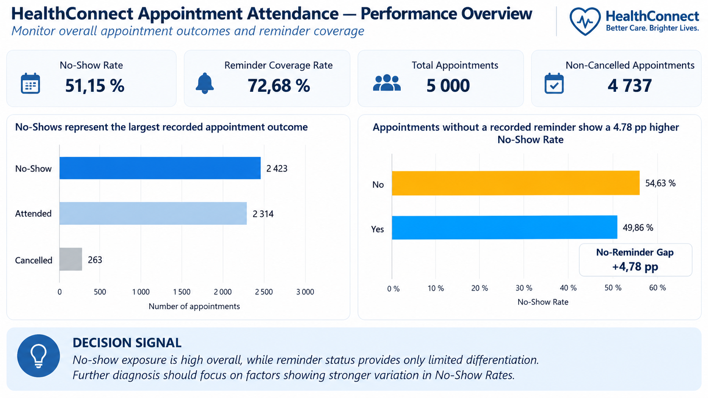
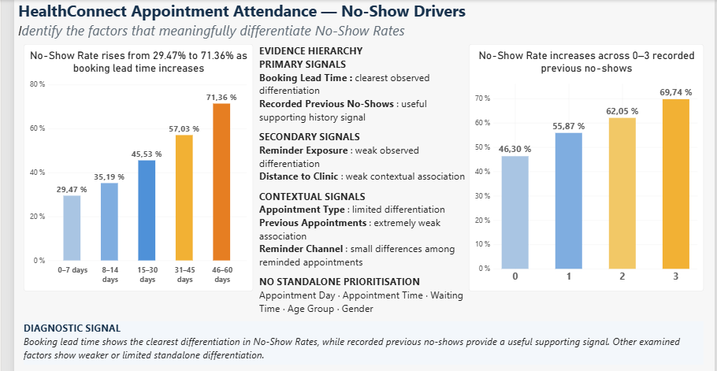
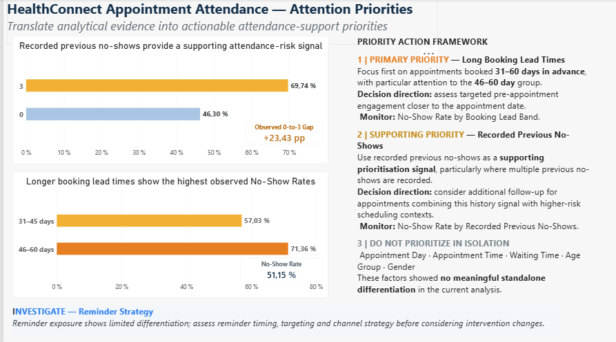

HealthConnect Experience Lab

Improving Patient Appointment Attendance and Healthcare Support Using Data and AI

Data Analytics Track | AnalystLab Africa Internship Programme

Author: Nancy Lee YIMBERE ALAPINI
Professional Focus: Performance & Decision Intelligence Analyst
Project Status: Week 5 — Analytics Development & Initial Implementation Completed

This repository documents the progressive development of the HealthConnect Experience Lab, from analytical foundation to evidence-based decision support.

1. Project Overview

The HealthConnect Experience Lab is a multidisciplinary project developed as part of the AnalystLab Africa Internship Programme.

From Week 4 onward, interns across Data Analytics, Data Science, Machine Learning Engineering, Generative AI, and Project Management contribute to a shared healthcare business problem from their respective professional perspectives.

HealthConnect Clinic faces challenges related to missed appointments, cancellations, and patient support needs.

The broader project question is:

How can HealthConnect Clinic use data and AI to reduce missed appointments and improve the patient support experience?

For the Data Analytics Track, the objective is to use appointment-level data to understand attendance and no-show patterns, evaluate relevant analytical hypotheses, develop decision-relevant KPIs, and translate validated evidence into actionable priorities.

2. Quick Navigation & Week 5 Deliverables

📊 Power BI Dashboard

01 | MONITOR · 02 | DIAGNOSE · 03 | PRIORITIZE

📦 Week 5 Deliverables

The Week 5 deliverables are stored in the notebooks, dashboards, and reports folders.

Deliverable

WK5_HealthConnect_Analytics_Nancy_Lee_YIMBERE_ALAPINI.ipynb

WK5_HealthConnect_Analytics_Dashboard_Nancy_Lee_YIMBERE_ALAPINI.pbix

WK5_HealthConnect_Business_Insights_Recommendations_Nancy_Lee_YIMBERE_ALAPINI.pdf

WK5_HealthConnect_Project_Summary_Nancy_Lee_YIMBERE_ALAPINI.pdf

Project Journey

Week 4 — Analytical Foundation → Week 5 — Analysis & Initial Implementation → Week 6 — Refinement & Integration

3. Project Continuity

The HealthConnect Experience Lab is a progressive multi-week project.

flowchart LR
    A["Week 4 UNDERSTAND"] --> B["REVIEW"]
    B --> C["DEFINE"]
    C --> D["PLAN"]
    D --> E["Week 5 PREPARE"]
    E --> F["ANALYSE"]
    F --> G["VALIDATE"]
    G --> H["MONITOR"]
    H --> I["DIAGNOSE"]
    I --> J["PRIORITIZE"]
    J --> K["Week 6 REFINE & INTEGRATE"]

Week 5 decision-support flow

MONITOR → DIAGNOSE → PRIORITIZE

MONITOR — establish the overall attendance situation and KPI baseline.

DIAGNOSE — determine which factors meaningfully differentiate No-Show Rates.

PRIORITIZE — translate analytical evidence into attention priorities while preserving interpretation guardrails.

WEEK 4 — ANALYTICAL FOUNDATION

3. Week 4 Objective

Week 4 focused on understanding, reviewing, defining, and planning rather than executing the full analysis.

The Data Analytics foundation established:

dataset and Data Dictionary understanding;

initial data-quality assessment;

appointment-level unit of analysis;

six Business Questions;

twelve analytical hypotheses;

three potential KPIs;

an initial analysis approach;

assumptions, limitations, risks, and dependencies.

Week 4 principle:
UNDERSTAND → REVIEW → DEFINE → PLAN

No final explanation of no-show drivers was claimed at this stage.

4. Week 4 Business Questions

BQ

Business Question

BQ1 — Overall Appointment Outcome

What is the overall distribution of appointment outcomes, and what is the relative extent of no-shows?

BQ2 — Appointment & Scheduling Context

How do no-show patterns vary across appointment types and scheduling characteristics, including day, time, and booking lead time?

BQ3 — Reminder & Engagement

How do no-show patterns vary by reminder status and, where applicable, reminder channel?

BQ4 — Accessibility & Operational Context

How do no-show patterns vary across recorded distance-to-clinic and estimated waiting-time levels?

BQ5 — Recorded Patient History

How do no-show patterns vary according to previous appointments and previous no-shows?

BQ6 — Recorded Patient Characteristics

How do no-show patterns vary across recorded age groups and gender categories?

WEEK 5 — ANALYSIS, VALIDATION & INITIAL IMPLEMENTATION

5. Week 5 Objective

Week 5 moved the project from analytical planning into practical analysis and initial implementation.

The work completed included:

data preparation and quality validation;

EDA structured by Business Question;

hypothesis evaluation;

KPI development and interpretation;

initial Power BI dashboard development;

evidence hierarchy and analytical prioritisation;

business insights and recommendations;

limitations and risk review;

preparation for the next project phase.

The analytical objective was not to scan every variable until something interesting appeared, but to start from the Business Questions defined in Week 4, test the corresponding hypotheses, and rank the resulting signals according to the strength and decision relevance of the observed evidence.

6. Data Preparation & Quality Validation

The original HealthConnect project resources were preserved unchanged.

Check

Result

Analytical Treatment

Dataset structure

5,000 rows × 18 columns

Expected structure retained

appointment_id

5,000 unique

Appointment-level unit of analysis confirmed

Exact duplicate rows

0

No duplicate removal required

Missing distance_to_clinic_km

90 (1.8%)

No automatic imputation

Missing waiting_time_minutes

60 (1.2%)

No automatic imputation

reminder_channel = None

1,366 records

Structural N/A when no reminder was sent

Repeated patient-level inconsistencies

Present

No longitudinal patient reconstruction

Data-quality guardrail

The appointment record remains the unit of analysis.

Repeated patient_id values were not treated as reliable longitudinal patient histories because several recorded demographic and historical attributes were not stable across repeated identifiers.

7. KPI Framework

Three Week 4 potential KPIs were operationalised in Week 5.

KPI

Definition

Week 5 Result

Linked BQ

No-Show Rate (%)

No-Shows / (Attended + No-Show)

51.15%

BQ1

Reminder Coverage Rate (%)

Appointments with reminder / All appointments

72.68%

BQ3

No-Show Rate by Reminder Status

No-Show Rate compared across reminder status

54.63% No Reminder / 49.86% Reminder Sent

BQ3

Supporting metric: No-Reminder Gap = +4.78 percentage points

Reminder exposure is interpreted as an observed association, not as evidence that reminders causally reduce no-shows.

8. Key Analytical Findings

8.1 Overall Appointment Outcome

Total appointments: 5,000

No-Show: 2,423

Attended: 2,314

Cancelled: 263

Non-cancelled analytical population: 4,737

Overall No-Show Rate: 51.15%

8.2 Booking Lead Time — Clearest Observed Differentiation

Booking Lead Time

No-Show Rate

0–7 days

29.47%

8–14 days

35.19%

15–30 days

45.53%

31–45 days

57.03%

46–60 days

71.36%

Spearman ρ = 0.2873, p < 0.001

Booking lead time shows the clearest observed differentiation in No-Show Rates among the factors examined.

8.3 Recorded Previous No-Shows — Supporting History Signal

Recorded Previous No-Shows

No-Show Rate

0

46.30%

1

55.87%

2

62.05%

3

69.74%

Observed 0-to-3 gap: +23.43 pp
Spearman ρ = 0.1214, p < 0.001

Recorded previous no-shows provide a useful supporting prioritisation signal, but should not be treated as a standalone predictor.

8.4 Reminder Exposure — Weak Observed Differentiation

Reminder Coverage Rate: 72.68%

No Reminder No-Show Rate: 54.63%

Reminder Sent No-Show Rate: 49.86%

No-Reminder Gap: +4.78 pp

Cramér's V: approximately 0.042

The difference is statistically detectable but the association is very weak.

Coverage ≠ effectiveness. Association ≠ causation.

9. Evidence Hierarchy

Evidence Level

Factors

Primary Signals

Booking Lead Time; Recorded Previous No-Shows

Secondary Signals

Reminder Exposure; Distance to Clinic

Contextual Signals

Appointment Type; Previous Appointments; Reminder Channel

No Standalone Prioritisation

Appointment Day; Appointment Time; Waiting Time; Age Group; Gender

This hierarchy deliberately considers descriptive evidence, statistical significance, effect size, stability, data quality, and decision relevance rather than relying on p-values alone.

📊 POWER BI DECISION-SUPPORT DASHBOARD

MONITOR → DIAGNOSE → PRIORITIZE

The Week 5 dashboard was designed as a decision-support journey, not as a collection of unrelated charts.

01 | MONITOR

Decision question: What is the current appointment-attendance situation?

Key signal: No-show exposure is high overall, while reminder status provides only limited differentiation. Further diagnosis should therefore focus on factors showing stronger variation in No-Show Rates.

02 | DIAGNOSE

Decision question: Which factors meaningfully differentiate No-Show Rates?

Diagnostic signal: Booking lead time shows the clearest differentiation in No-Show Rates, while recorded previous no-shows provide a useful supporting signal. Other examined factors show weaker or limited standalone differentiation.

03 | PRIORITIZE

Decision question: Where should HealthConnect focus analytical and operational attention first?

Priority logic:

Primary Priority — Long Booking Lead Times

Supporting Priority — Recorded Previous No-Shows

Investigate — Reminder Strategy

Do Not Prioritise in Isolation — factors without meaningful standalone differentiation

11. From Evidence to Decision Support

The Week 5 interpretation follows the chain:

Business Question → Hypothesis → Analysis → Finding → Evidence → Interpretation → Business Implication → Recommendation

Priority 1 — Long Booking Lead Time

Focus analytical and operational attention first on appointments booked 31–60 days in advance, with particular attention to the 46–60 day group.

Decision direction: assess targeted pre-appointment engagement closer to the appointment date.

Monitor: No-Show Rate by Booking Lead Band.

Priority 2 — Recorded Previous No-Shows

Use recorded previous no-shows as a supporting prioritisation signal, particularly where multiple previous no-shows are recorded.

Decision direction: consider additional follow-up when this history signal occurs alongside higher-risk scheduling contexts.

Monitor: No-Show Rate by Recorded Previous No-Shows.

Investigate — Reminder Strategy

Reminder exposure shows limited differentiation. Before changing reminder interventions, investigate:

reminder timing;

targeting;

channel strategy;

interactions with stronger attendance-risk signals.

Do Not Prioritise in Isolation

Current evidence does not justify standalone prioritisation based solely on:

appointment day;

appointment time;

waiting time;

age group;

gender.

12. Interpretation Guardrails

Correlation ≠ Causality

Benchmark ≠ Target

Statistical significance alone does not establish decision relevance.

Weak associations are not promoted to primary drivers.

Sparse categories are not used to define intervention thresholds.

Patient-level histories are not reconstructed from inconsistent repeated patient_id records.

Recommendations remain proportionate to the evidence available in Week 5.

13. Cross-Track Collaboration Status

Cross-track collaboration was not completed within the Week 5 submission window.

Given the deadline, priority was given to completing, validating, and documenting the Data Analytics track deliverables rather than claiming an exchange that had not occurred.

This dependency remains open for Week 6, when validated analytical findings can be shared with relevant tracks for integration, refinement, or downstream modelling.

14. Week 5 Deliverables

The Week 5 files are organised in the repository folders notebooks, dashboards, and reports.

Deliverable

Role

WK5_HealthConnect_Analytics_Nancy_Lee_YIMBERE_ALAPINI.ipynb

Reproducible data preparation, EDA, hypothesis evaluation and KPI calculations

WK5_HealthConnect_Analytics_Dashboard_Nancy_Lee_YIMBERE_ALAPINI.pbix

Initial analytical dashboard: MONITOR → DIAGNOSE → PRIORITIZE

WK5_HealthConnect_Business_Insights_Recommendations_Nancy_Lee_YIMBERE_ALAPINI.pdf

Findings, business implications and recommendations

WK5_HealthConnect_Project_Summary_Nancy_Lee_YIMBERE_ALAPINI.pdf

Concise Week 5 implementation summary

15. Week 4 Deliverables

The Week 4 analytical foundation remains available in the same repository.

Deliverable

Role

WK4_HealthConnect_Initial_Analysis_Document_Nancy_Lee_YIMBERE_ALAPINI.pdf

Main Week 4 analytical foundation

WK4_HealthConnect_Technical_Data_Inspection_Notebook_Nancy_Lee_YIMBERE_ALAPINI.ipynb

Reproducible supporting technical evidence

WK4_HealthConnect_Technical_Data_Inspection_Notebook_Nancy_Lee_YIMBERE_ALAPINI.pdf

Readable notebook export

WK4_HealthConnect_Project_Summary_Nancy_Lee_YIMBERE_ALAPINI.pdf

Concise project foundation summary

16. Week 6 Focus

16. Week 6 Focus

The next phase should focus on:

testing whether combinations of Booking Lead Time + Recorded Previous No-Shows improve prioritisation;

refining intervention hypotheses without converting associations into causal claims;

investigating reminder timing, targeting, and channel strategy;

initiating meaningful cross-track collaboration where relevant;

refining and testing the initial analytical outputs;

maintaining KPI traceability and cross-deliverable consistency.

17. Analytical Method

The project follows a question-driven rather than chart-driven analytical logic:

Business Problem → Business Questions → Hypotheses → Data → Analysis → Findings → Insights → Business Implications → Recommendations → Decision Support

The Week 5 dashboard operationalises this logic through:

MONITOR → DIAGNOSE → PRIORITIZE

The objective is not to maximise the number of analytical outputs, but to establish which results are sufficiently supported to deserve a place in decision-making.

Author

Nancy Lee YIMBERE ALAPINI
Performance & Decision Intelligence Analyst
AnalystLab Africa Internship Programme — HealthConnect Experience Lab

Project Status

Week 4 — Analytical Foundation ✅
Week 5 — Analysis, KPI Development & Initial Implementation ✅
Week 6 — Refinement & Integration ⏳
